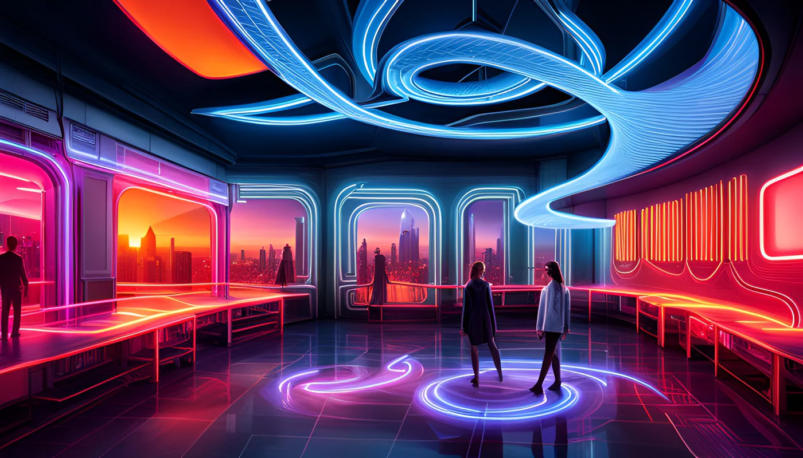

# jixu2013_9103_tut02
## Week8 Quiz 
### Part 1: Imaging Technique Inspiration

[Design Project - *Monet “Woman with a Parasol” with motion and sound*](https://youtu.be/C26x4rWvaU8?si=49SgFTsNsrsJcwQ6)

[Design Project - *Neon Space: Neon-inspired Visions of the Future*](https://neonhub.com/blogs/news/neon-space-neon-inspired-visions-of-the-future?srsltid=AfmBOooKwJMJrvwT4lDLQj5koVCFkOMxcVOoR5Zp6cJtAfkphdrZ3YHb)

Film - *Blade Runner Neon Scene Screenshot*

The imaging techniques shown above have inspired me. Firstly, in the design project *Woman with a Parasol*, the creator animated the background colour lines while keeping the subject static, using a dynamic background to create a dynamic painting effect. I wanted to apply this technique in my project to make the project more abstract and dynamic. Secondly, the mixing of colours and contrast of light and dark in the neon lights in *Neon Space* and the film *Blade Runner* provide inspiration to create abstract project with assignment artworks. And both of these components can be incorporated in my project. These imaging techniques will be incorporated into my project as beneficial techniques.

### Part 2: Coding Technique Exploration
 

[Coding Technique - Adjusting Positions with a Shader](https://p5js.org/examples/3d-adjusting-positions-with-a-shader/)

The above demonstrates the coding technique I chose that can help implement the creation of the selected imaging technique. Which uses the coding technique of adjusting positions with a shader allows for dynamic manipulation of vertices, enabling the creation of movement and distortion effects. In the case of my project, this shader technique can be applied to animate the background while keeping the central subject static, similar to the effect used in the *Woman with a Parasol* animation design project. By distorting and animating vertices over time, the shader can generate fluid background motion, enhancing the dynamism and depth in contrast with the still subject, while also integrating neon-like color transitions for a dynamic, fantasy, dreamy aesthetic.